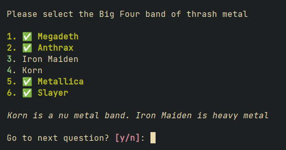

# Certification Trainer
Certification Trainer is a Python script useful for repeating single and multiple choice quiz(zes).

It reads data from a JSON file, prompting the user for the correct answer(s). Correct and selected answer(s) are printed for each question

 

Minimalistic statistics are shown at the end of the quiz

